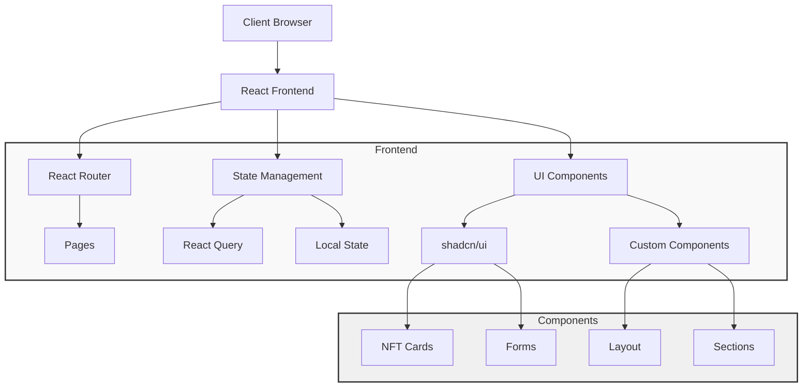
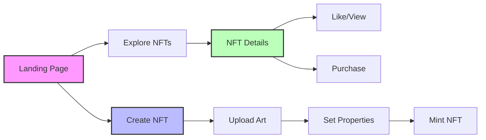
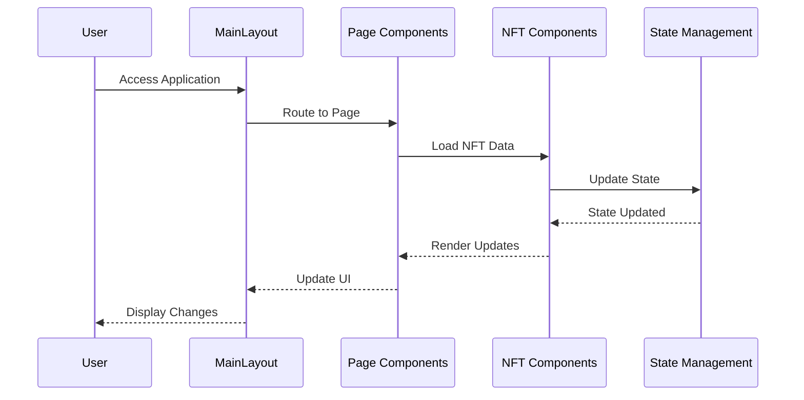

# NFT Marketplace - Technical Documentation

## 1. Introduction
PixelMarket is a modern NFT (Non-Fungible Token) marketplace built on a test blockchain environment. The platform enables users to mint, collect, and trade digital assets without the risks associated with real cryptocurrency transactions. This documentation provides a comprehensive overview of the system architecture, features, and technical implementation.

### Project Overview
- **Platform Name**: PixelMarket
- **Type**: Test Blockchain NFT Marketplace
- **Primary Technologies**: React, TypeScript, Tailwind CSS, shadcn/ui
- **Target Users**: Digital artists, collectors, and blockchain enthusiasts

## 2. System Architecture

### 2.1 System Architecture Diagram


### 2.2 Technology Stack
```
Frontend:
- React with TypeScript
- Vite (Build Tool)
- TailwindCSS (Styling)
- shadcn/ui (Component Library)
- React Router (Navigation)
- React Query (State Management)

Development Tools:
- Node.js
- npm/bun (Package Manager)
- Git (Version Control)
```

### 2.3 Project Structure
```
src/
├── components/
│   ├── layout/     # Layout components
│   ├── nft/        # NFT-specific components
│   ├── sections/   # Page sections
│   └── ui/         # UI components
├── pages/          # Main application pages
├── hooks/          # Custom React hooks
└── lib/           # Utility functions
```

### 2.3 Component Architecture
The application follows a component-based architecture with:
- Reusable UI components (shadcn/ui)
- Layout components for consistent structure
- Feature-specific components for NFT functionality
- Page components for routing

### 2.4 User Flow Diagram


### 2.5 Component Interaction Pattern


## 3. Features & Screenshots

### 3.1 Key Features
1. **NFT Exploration**
   - Browse NFT collections
   - Advanced filtering system
   - Search functionality
   - Category-based browsing

2. **NFT Creation**
   - Upload artwork
   - Set properties and metadata
   - Collection assignment
   - Price setting

3. **NFT Details**
   - Detailed NFT information
   - Price history
   - Property display
   - Like/View system

4. **User Interface**
   - Responsive design
   - Dark/Light mode
   - Modern animations
   - Interactive components

### 3.2 User Interface Components
- Modern gradient backgrounds
- Floating animations for visual appeal
- Interactive cards and buttons
- Responsive layout for all devices

## 4. Technical Implementation

### 4.1 State Management
```typescript
// Example of state management in NFT Detail page
const NFTDetail = () => {
  const [isLiked, setIsLiked] = useState(false);
  const [likeCount, setLikeCount] = useState(nftSample.likes);
  const [showProperties, setShowProperties] = useState(true);
};
```

### 4.2 Routing System
```typescript
<Routes>
  <Route path="/" element={<Index />} />
  <Route path="/explore" element={<Explore />} />
  <Route path="/nft/:id" element={<NFTDetail />} />
  <Route path="/create" element={<Create />} />
  <Route path="*" element={<NotFound />} />
</Routes>
```

### 4.3 Component Examples
- MainLayout for consistent page structure
- NFTCard for displaying NFT items
- CollectionCard for NFT collections
- Custom UI components from shadcn/ui

### 4.4 Core Component Implementation

#### NFTCard Component
```typescript
// Key features of the NFTCard component:
- Responsive image handling with aspect ratio
- Like/View system with local state management
- Hover animations and transitions
- Price display with currency
- Buy Now functionality
- Link integration with React Router
```

#### CollectionCard Component
```typescript
// Key features of the CollectionCard component:
- Cover image with gradient overlay
- Creator avatar integration
- Verification badge system
- Item count display
- Responsive layout
```

### 4.5 State Management Patterns
```typescript
// Example of local state management
const [isLiked, setIsLiked] = useState(false);
const [likeCount, setLikeCount] = useState(initialLikes);

// Example of interaction handlers
const handleLikeToggle = () => {
  setIsLiked(!isLiked);
  setLikeCount(isLiked ? likeCount - 1 : likeCount + 1);
};
```

### 4.6 Animation and Styling
```css
/* Card hover effects */
.nft-card-hover {
  transition: all 0.3s ease;
}

/* Image scaling */
.hover:scale-105 {
  transition: transform 0.7s ease;
}

/* Gradient overlays */
.bg-gradient-to-t {
  background: linear-gradient(to top, rgba(0,0,0,0.5), transparent);
}
```

### 4.7 Performance Optimizations
1. **Image Loading**
   - Aspect ratio preservation
   - Lazy loading implementation
   - Image optimization techniques

2. **State Management**
   - Local state for UI interactions
   - Optimistic updates for better UX
   - Efficient re-render patterns

3. **Component Architecture**
   - Modular design
   - Reusable components
   - Props interface definitions

### 4.8 Security Considerations
1. **Input Validation**
   - Form data validation
   - Image upload restrictions
   - Price formatting checks

2. **Transaction Safety**
   - Confirmation dialogs
   - Error handling
   - Loading states

3. **Data Protection**
   - Secure routing
   - Protected routes
   - Data encryption

### 4.9 Testing Strategy
1. **Unit Tests**
   - Component rendering
   - State management
   - User interactions

2. **Integration Tests**
   - Route navigation
   - Data flow
   - Component integration

3. **E2E Tests**
   - User flows
   - Transaction processes
   - Error scenarios

## 5. Challenges & Solutions

### 5.1 Responsive Design
**Challenge**: Creating a consistent user experience across all device sizes.
**Solution**: 
- Implemented Tailwind CSS breakpoints
- Mobile-first approach
- Flexible grid systems
- Adaptive component layouts

### 5.2 Performance Optimization
**Challenge**: Handling large numbers of NFTs and images efficiently.
**Solution**:
- Lazy loading for images
- Pagination for NFT lists
- Optimized state management
- Efficient component rendering

### 5.3 User Experience
**Challenge**: Creating an intuitive interface for blockchain interactions.
**Solution**:
- Clear user feedback
- Interactive tooltips
- Step-by-step guides
- Loading states and animations

## 6. API/Library References

### 6.1 Key Dependencies
```json
{
  "react": "^18.0.0",
  "react-router-dom": "^6.0.0",
  "tailwindcss": "^3.0.0",
  "@radix-ui/react-*": "Various UI primitives",
  "lucide-react": "Icon library",
  "@tanstack/react-query": "Data fetching"
}
```

### 6.2 UI Components
- Buttons, Cards, Inputs
- Modals, Tooltips
- Forms, Tables
- Navigation elements

## 7. Installation & Deployment

### 7.1 Local Development
```bash
# Clone repository
git clone [repository-url]

# Install dependencies
npm install

# Start development server
npm run dev

# Build for production
npm run build
```

### 7.2 Deployment
- Build the project using `npm run build`
- Deploy the `dist` folder to hosting platform
- Configure environment variables
- Set up domain and SSL

## 8. Future Improvements

### 8.1 Planned Features
1. Real-time notifications
2. Advanced search filters
3. Social features
4. Analytics dashboard

### 8.2 Technical Improvements
1. Performance optimization
2. Enhanced security measures
3. Additional payment methods
4. Mobile app development

---

This documentation is maintained by the PixelMarket development team and is subject to regular updates as the platform evolves.